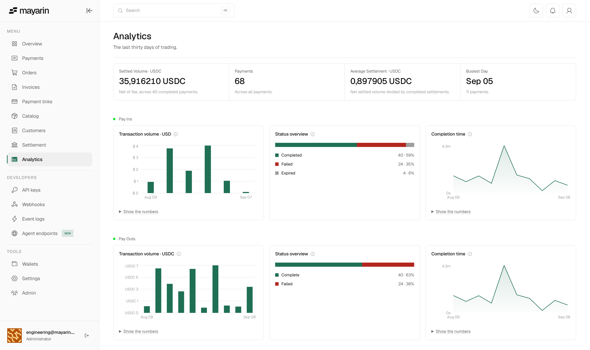
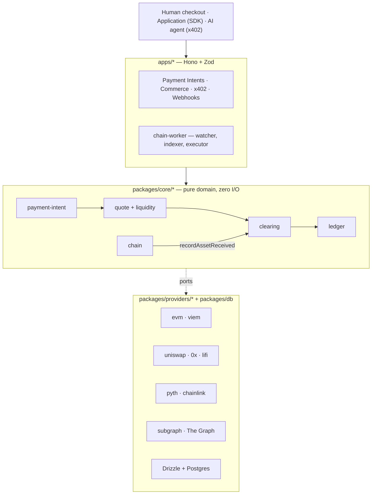

<div align="center">

# Mayarin

### The merchant names one price in their own currency. The payer brings whatever they hold. Both numbers are exact.

<a href="https://mayarin.xyz"></a>

[](https://api-testnet.mayarin.xyz)
[](https://sepolia.basescan.org/address/0xee7c5b5a9eeaf667a6efb217a8a77534c873f7a9)
[](./docs/arc.md)
[](./docs/liquidity-routing.md)
[](./packages/subgraph)
[](./docs/x402.md)

**Live on testnet.** A programmable clearing layer for humans, applications and autonomous agents.
Merchants price in their local currency and settle in a stablecoin; the payer brings any supported
asset. Every settlement below is a transaction you can open on a block explorer.

</div>

---

## The problem

A merchant in Jakarta prices a bag of coffee at IDR 50,000. A customer wants to pay in EURC. An
agent wants to pay for one API call and has never heard of an account.

To serve any of them today, the merchant has to become an infrastructure team:

```
   accept crypto      →    pick a chain, hold a wallet, fund it with gas
                      →    watch a rate that moves while the customer decides
                      →    swap, hope the pool is deep enough, eat the slippage
                      →    reconcile a balance nobody can explain
```

## The solution

One clearing layer between the two. The merchant's number is locked first, and everything else is
derived from it.

```
   merchant prices       IDR 50,000, in their own currency
   payer holds           ETH, EURC, USDC, or another configured asset
   Mayarin locks         the merchant's stablecoin settlement minimum
   merchant receives     exactly the configured settlement amount
```

The merchant never sees a chain, a gas token, or a slippage setting. **An autonomous agent is a
payer class, not a product line** — it reaches the same clearing engine, ledger and merchant as a
person at a checkout, and is given one thing to sign.

## How it works

```
   1  INTENT     the merchant states a price and a settlement asset
   2  LOCK       the quote engine freezes the settlement minimum
   3  PAY        contract call, deposit transfer, or one signed x402 authorization
   4  CONFIRM    the receipt is read back off the chain and matched
   5  RECORD     clearing transition + balanced ledger postings, one DB transaction

                                ↓

      merchant paid  ──►  exactly the invoice, or the payment does not advance
```

A submitted transaction is never proof of payment, and a webhook only _wakes_ the engine — the
chain is the truth.

## Architecture

Ports and adapters: **a domain package never imports a concrete adapter.**
`apps/api/src/container.ts` is the only file that knows which implementations run.



Three execution paths, chosen per payment:

| Path              | The payer does                                  | Advances on                                      |
| ----------------- | ----------------------------------------------- | ------------------------------------------------ |
| **Contract**      | Calls `PaymentRouter` with a signed order       | A `PaymentCompleted` log past confirmation depth |
| **Deposit-match** | Sends a transfer to a unique per-intent address | A confirmed deposit matched to the intent        |
| **x402**          | Signs one EIP-3009 authorization                | The receipt read back and matched                |

Full detail: [Architecture](./docs/architecture.md) · [Clearing Engine](./docs/clearing-engine.md)
· [Agent payments](./docs/x402.md).

## Deployed

Testnet only. Mainnet is deliberately unprovisioned.

| Chain            | `PaymentRouter`                                                                                  | `DepositForwarderFactory`                                                                        |
| ---------------- | ------------------------------------------------------------------------------------------------ | ------------------------------------------------------------------------------------------------ |
| Base Sepolia     | [`0xee7c5b5a…`](https://sepolia.basescan.org/address/0xee7c5b5a9eeaf667a6efb217a8a77534c873f7a9) | [`0x69c72C51…`](https://sepolia.basescan.org/address/0x69c72C5191149e85CD862FCcccC2A6F699E9582F) |
| Ethereum Sepolia | [`0xE54E800b…`](https://sepolia.etherscan.io/address/0xE54E800bfFD1fBb5756B7c5E6A4aa40Dd09210E7) | [`0xCa83514c…`](https://sepolia.etherscan.io/address/0xCa83514c0bef26B642f7A69b2ab529c2ab5d7958) |
| Arc Testnet      | [`0xee7c5b5a…`](https://testnet.arcscan.app/address/0xee7c5b5a9eeaf667a6efb217a8a77534c873f7a9)  | [`0x04cd74e7…`](https://testnet.arcscan.app/address/0x04cd74e77ac145b18d61c6c8d7939e3241dbb60a)  |

## What you get

|                                  |                                                                   |
| -------------------------------- | ----------------------------------------------------------------- |
| Price in your own currency       | IDR, USD, EUR and more — settle in a stablecoin                   |
| Payer brings any supported asset | exact-output swaps priced backwards from the invoice              |
| Money is never a float           | `bigint` minor units end to end, double-entry ledger              |
| Agents pay per call              | x402 — no account, no API key, one signature                      |
| Commerce out of the box          | catalog, payment links, invoices, hosted checkout, dashboard, SDK |
| Anyone can check                 | every settlement is a transaction on a public block explorer      |

## Built with

### The Graph

A settlements subgraph on Subgraph Studio (Base Sepolia, Arc testnet) feeds the settlement indexer
and a paid MCP server at `POST /x402/mcp`. `choose_rail` tells an agent which rail to pay on, from
how each rail has actually been settling. A Circle agent wallet paid $0.10 for one call:
[`0xdce241e2…`](https://sepolia.basescan.org/tx/0xdce241e203e3de3fd1fcd2e2e421d5a7d97a5ff8174a3df2314a4bf73baf6c8b).
Write-up: [docs/submission/the-graph.md](./docs/submission/the-graph.md).

### Arc (Circle)

USDC-native settlement on Arc testnet, a merchant Safe per chain, and Circle Agent Stack
contract-account payers whose EIP-1271 signatures the token accepts. Payer's gas zero. Evidence in
[`docs/evidence/`](./docs/evidence/); write-up: [docs/submission/arc.md](./docs/submission/arc.md).

### Uniswap

Cross-asset x402: an agent holding EURC pays a merchant settled in USDC, through an exact-output swap
priced backwards from the invoice — authorization
[`0x254b93ce…`](https://sepolia.basescan.org/tx/0x254b93cec1a73279e12968938c1c491133c5556b4adb9e71cea070e0abc8affa),
swap [`0xb1436735…`](https://sepolia.basescan.org/tx/0xb143673599a6b05cd95676f0bbec7ffc35f9f99563bf45c6f26468944eb38a07).
Write-up: [docs/submission/uniswap.md](./docs/submission/uniswap.md).

Entered in [ETHOnline 2026](https://ethglobal.com/events/ethonline2026) in the **Continuity** pool.
What predates the window and what was built during it: [ROADMAP.md](./ROADMAP.md).

## Quick start

Requires [Bun](https://bun.sh) 1.4+, Node 22.12+, and Docker.

```bash
git clone https://github.com/playriglabs/mayarin.git
cd mayarin
bun run setup            # install, write .env, start Postgres, migrate
bun run dev:all          # core API + chain worker + dashboard + checkout
```

```ts
import { createMayarin } from "@mayarin/sdk";

const mayarin = createMayarin({
  baseUrl: "https://api-testnet.mayarin.xyz",
  secretKey: process.env.MAYARIN_SECRET_KEY,
});

const link = await mayarin.commerce.paymentLinks.create(
  {
    kind: "fixed",
    merchant: {
      id: "merchant_123",
      name: "Toko Melati",
      city: "Jakarta",
      countryCode: "ID",
    },
    amount: { amount: "50000.00", asset: "IDR" },
  },
  { idempotencyKey: "order-4711" },
);
```

Commands, conventions and tests: [AGENT.md](./AGENT.md). Design record: [`docs/`](./docs/README.md).
API reference: [docs.mayarin.xyz](https://docs.mayarin.xyz).

## Where this actually is, right now

**[mayarin.xyz](https://mayarin.xyz)** — shipped and running on testnet: clearing core, double-entry
ledger, contract and deposit execution, oracle-guarded quotes, commerce and hosted checkout, merchant
dashboard, SDK, and agent payments.

Not done, and not pretended otherwise:

- Fiat rails (QRIS, bank transfer) and the off-ramp are later phases.
- Mainnet is planned, not provisioned.
- Testnet pool depth is not market depth; the oracle deviation guard is widened on testnet.

## License

[Apache License 2.0](./LICENSE) — copyright 2026 Playrig Labs. Solidity sources under
`packages/contracts/payment-router` stay MIT.
