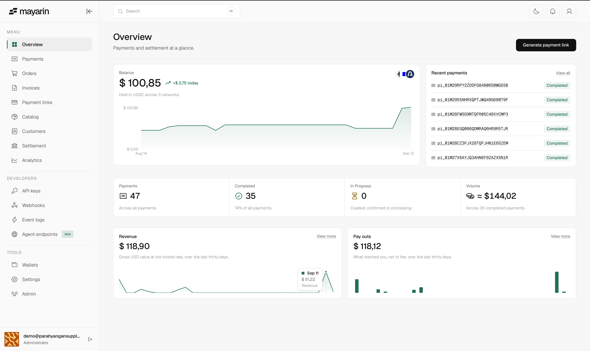
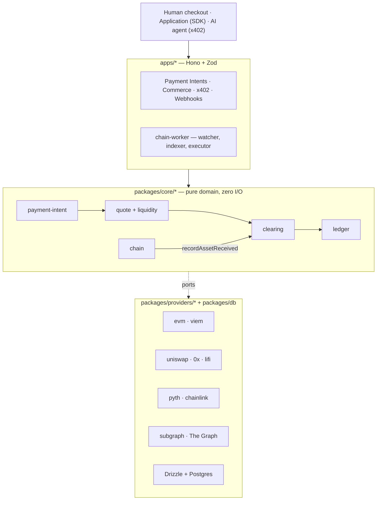

<div align="center">

# Mayarin

### The merchant names one price in their own currency. The payer brings whatever they hold. Both numbers are exact.

<a href="https://mayarin.xyz"></a>

[](https://api-testnet.mayarin.xyz)

A programmable clearing layer for humans, applications and autonomous agents.
Merchants price in their local currency and settle in a stablecoin; the payer brings any supported
asset. Every settlement below is a transaction you can open on a block explorer.

</div>

---

## The problem

A coffee roaster in Jakarta prices a bag at IDR 50,000 and wants to sell beyond Indonesia. A
customer in Berlin wants to pay in EURC. An agent wants to pay for one API call and has never
heard of an account.

To sell to either of them today, the merchant has to become an infrastructure team:

```
   accept crypto      →    pick a chain, hold a wallet, fund it with gas
                      →    watch a rate that moves while the customer decides
                      →    swap, hope the pool is deep enough, eat the slippage
                      →    reconcile a balance nobody can explain
```

## The solution

One clearing layer between the two. The merchant's number is locked first, and everything else is
derived from it.

```
   merchant prices       IDR 50,000, in their own currency
   payer holds           ETH, EURC, USDC, or another configured asset
   Mayarin locks         the merchant's stablecoin settlement minimum
   merchant receives     exactly the configured settlement amount
```

The merchant never sees a chain, a gas token, or a slippage setting. **An autonomous agent is a
payer class, not a product line** — it reaches the same clearing engine, ledger and merchant as a
person at a checkout, and is given one thing to sign.

## How it works

```
   1  INTENT     the merchant states a price and a settlement asset
   2  LOCK       the quote engine freezes the settlement minimum
   3  PAY        contract call, deposit transfer, or one signed x402 authorization
   4  CONFIRM    the receipt is read back off the chain and matched
   5  RECORD     clearing transition + balanced ledger postings, one DB transaction

                                ↓

      merchant paid  ──►  exactly the invoice, or the payment does not advance
```

A submitted transaction is never proof of payment, and a webhook only _wakes_ the engine — the
chain is the truth.

## Architecture

Ports and adapters: **a domain package never imports a concrete adapter.**
`apps/api/src/container.ts` is the only file that knows which implementations run.



Three execution paths, chosen per payment:

| Path              | The payer does                                  | Advances on                                      |
| ----------------- | ----------------------------------------------- | ------------------------------------------------ |
| **Contract**      | Calls `PaymentRouter` with a signed order       | A `PaymentCompleted` log past confirmation depth |
| **Deposit-match** | Sends a transfer to a unique per-intent address | A confirmed deposit matched to the intent        |
| **x402**          | Signs one EIP-3009 authorization                | The receipt read back and matched                |

Full detail: [Architecture](./docs/architecture.md) · [Clearing Engine](./docs/clearing-engine.md)
· [Agent payments](./docs/x402.md).

## Agent payments (x402)

Any Mayarin-gated endpoint becomes payable per call by an agent that has never registered, holds no
API key, and never sees a checkout page. It gets a `402` with machine-readable terms, signs one
[EIP-3009](https://eips.ethereum.org/EIPS/eip-3009) authorization for an exact amount, and gets the
resource.

```
   agent calls endpoint   →   402 + terms
   agent signs            →   one EIP-3009 authorization, exact amount
   Mayarin settles        →   receipt read back and matched, ledger posted
   agent gets             →   the resource
```

An agent that does not hold the merchant's asset still pays. The swap is priced **backwards** from
the invoice — exact-output, so the merchant gets exactly the invoice or the swap reverts:

```
   authorization   payer    →  operator    the agent's asset, exactly what it signed for
   swap            operator →  pool        exact-output, bounded by the authorization
                   pool     →  merchant    exactly the invoice
   surplus                                 what the pool did not need, owed back to the payer
```

**Paid MCP server.** `POST /x402/mcp` sells tools over the same rail: `initialize` and `tools/list`
are free, `tools/call` costs one authorization. `rail_stats` and `choose_rail` answer which rail to
pay on, from Mayarin's own settlements subgraph. Discovery is free, answers are paid, and a bad
request is refused before anything is charged.

```bash
curl -X POST $API/x402/mcp -H 'content-type: application/json' \
  -d '{"jsonrpc":"2.0","id":1,"method":"tools/list"}'
```

Current boundaries: `exact` scheme only, EVM only, and the broadcaster pays gas. Full detail in
[docs/x402.md](./docs/x402.md).

## Deployed

Testnet only. Mainnet is deliberately unprovisioned.

| Chain            | `PaymentRouter`                                                                                  | `DepositForwarderFactory`                                                                        |
| ---------------- | ------------------------------------------------------------------------------------------------ | ------------------------------------------------------------------------------------------------ |
| Base Sepolia     | [`0xee7c5b5a…`](https://sepolia.basescan.org/address/0xee7c5b5a9eeaf667a6efb217a8a77534c873f7a9) | [`0x69c72C51…`](https://sepolia.basescan.org/address/0x69c72C5191149e85CD862FCcccC2A6F699E9582F) |
| Ethereum Sepolia | [`0xE54E800b…`](https://sepolia.etherscan.io/address/0xE54E800bfFD1fBb5756B7c5E6A4aa40Dd09210E7) | [`0xCa83514c…`](https://sepolia.etherscan.io/address/0xCa83514c0bef26B642f7A69b2ab529c2ab5d7958) |
| Arc Testnet      | [`0xee7c5b5a…`](https://testnet.arcscan.app/address/0xee7c5b5a9eeaf667a6efb217a8a77534c873f7a9)  | [`0x04cd74e7…`](https://testnet.arcscan.app/address/0x04cd74e77ac145b18d61c6c8d7939e3241dbb60a)  |

## What you get

|                                  |                                                                   |
| -------------------------------- | ----------------------------------------------------------------- |
| Price in your own currency       | IDR, USD, EUR and more — settle in a stablecoin                   |
| Payer brings any supported asset | exact-output swaps priced backwards from the invoice              |
| Money is never a float           | `bigint` minor units end to end, double-entry ledger              |
| Agents pay per call              | x402 — no account, no API key, one signature                      |
| Commerce out of the box          | catalog, payment links, invoices, hosted checkout, dashboard, SDK |
| Anyone can check                 | every settlement is a transaction on a public block explorer      |

## Built with

### The Graph

A settlements subgraph on Subgraph Studio (Base Sepolia, Arc testnet) feeds the settlement indexer
and a paid MCP server at `POST /x402/mcp`. `choose_rail` tells an agent which rail to pay on, from
how each rail has actually been settling. A Circle agent wallet paid $0.10 for one call:
[`0xdce241e2…`](https://sepolia.basescan.org/tx/0xdce241e203e3de3fd1fcd2e2e421d5a7d97a5ff8174a3df2314a4bf73baf6c8b).
Write-up: [docs/submission/the-graph.md](./docs/submission/the-graph.md).

### Arc (Circle)

Arc is the merchant's settlement rail. Its gas token and the merchant's settlement asset are the
same thing, USDC, so a merchant never has to hold a second token to get paid.

**Multi-step settlement with a condition.** An agent holding EURC pays a merchant who is owed USDC,
and signs only once. Three things then happen on chain: the authorization is settled, an
exact-output swap runs, and the merchant is paid. If the pool cannot deliver the full invoice, the
swap reverts, so the merchant gets the exact amount or nothing moves. Authorization
[`0xf08c141d…`](https://testnet.arcscan.app/tx/0xf08c141d2c11de1ac9abc3ca1b4da201bce901250148bd4436b86b421638beba),
swap
[`0x9f4bf25b…`](https://testnet.arcscan.app/tx/0x9f4bf25b74fe3cb18087ff4e93eff22b530b48f2e7a41fbd064280f3abfc1e52).

**Agent decisions tied to real signals.** The demo agent (`bun run demo:agent`) prints each
decision it makes, and the reason for it:

| Decision          | Signal                                                                |
| ----------------- | --------------------------------------------------------------------- |
| Which rail to pay | Settlement headroom from Mayarin's subgraph, bought over x402         |
| Whether to sign   | The quote is checked against an oracle and refused if it has drifted  |
| How much to spend | A spend ceiling, checked before signing, so nothing over it is signed |

**Circle products**

| Used                         | How                                                                              |
| ---------------------------- | -------------------------------------------------------------------------------- |
| Arc testnet                  | `PaymentRouter`, `DepositForwarderFactory`, x402 settlement                      |
| USDC, EURC                   | USDC is what merchants settle in; EURC is a payer asset for cross-asset payments |
| Agent Stack (Circle Wallets) | A contract-account wallet pays, and USDC verifies it through EIP-1271            |

Not used: App Kits, Nanopayments, Paymaster, CCTP, Gateway, StableFX. The payer pays no gas because
Mayarin's operator broadcasts the signed authorization. That is not Paymaster.

**Qualification**

- Frontend: merchant dashboard, hosted checkout, and the paywall in `apps/x402-merchant`
- Backend: `apps/api` and `apps/chain-worker`, live at `api-testnet.mayarin.xyz`
- Architecture diagram: [Architecture](#architecture)
- Video: _link to come_
- Write-up and on-chain evidence: [docs/submission/arc.md](./docs/submission/arc.md)

### Uniswap

Cross-asset x402: an agent holding EURC pays a merchant settled in USDC, through an exact-output swap
priced backwards from the invoice — authorization
[`0x254b93ce…`](https://sepolia.basescan.org/tx/0x254b93cec1a73279e12968938c1c491133c5556b4adb9e71cea070e0abc8affa),
swap [`0xb1436735…`](https://sepolia.basescan.org/tx/0xb143673599a6b05cd95676f0bbec7ffc35f9f99563bf45c6f26468944eb38a07).
Write-up: [docs/submission/uniswap.md](./docs/submission/uniswap.md).

What predates the window and what was built during it: [ROADMAP.md](./ROADMAP.md).

## Quick start

Requires [Bun](https://bun.sh) 1.4+, Node 22.12+, and Docker.

```bash
git clone https://github.com/playriglabs/mayarin.git
cd mayarin
bun run setup            # install, write .env, start Postgres, migrate
bun run dev:all          # core API + chain worker + dashboard + checkout
```

```ts
import { createMayarin } from "@mayarin/sdk";

const mayarin = createMayarin({
  baseUrl: "https://api-testnet.mayarin.xyz",
  secretKey: process.env.MAYARIN_SECRET_KEY,
});

const link = await mayarin.commerce.paymentLinks.create(
  {
    kind: "fixed",
    merchant: {
      id: "merchant_123",
      name: "Toko Melati",
      city: "Jakarta",
      countryCode: "ID",
    },
    amount: { amount: "50000.00", asset: "IDR" },
  },
  { idempotencyKey: "order-4711" },
);
```

Commands, conventions and tests: [AGENT.md](./AGENT.md). Design record: [`docs/`](./docs/README.md).
API reference: [docs.mayarin.xyz](https://docs.mayarin.xyz).

## Where this actually is, right now

**[mayarin.xyz](https://mayarin.xyz)** — shipped and running on testnet: clearing core, double-entry
ledger, contract and deposit execution, oracle-guarded quotes, commerce and hosted checkout, merchant
dashboard, SDK, and agent payments.

Not done, and not pretended otherwise:

- Fiat rails (QRIS, bank transfer) and the off-ramp are later phases.
- Mainnet is planned, not provisioned.
- Testnet pool depth is not market depth; the oracle deviation guard is widened on testnet.

## License

[Apache License 2.0](./LICENSE) — copyright 2026 Playrig Labs. Solidity sources under
`packages/contracts/payment-router` stay MIT.
