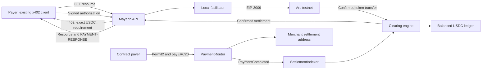

# Arc payment rail

Mayarin prices in the merchant's currency and clears supported payer assets into
stablecoin settlement. Arc testnet is one of its execution rails. The payer can
use an existing x402 client; Mayarin does not require a payer SDK or account.



Deployment addresses and their throwaway status are in [chain.md](./chain.md).
Arc mainnet is not a supported `ChainId` in this revision. The checked criterion
for chain support covers `arc-testnet`; mainnet must be a separately verified
addition, not an invented configuration value.

## Native-decimal audit

Arc has one USDC holding with an 18-decimal native interface and a 6-decimal
ERC-20 interface. Domain USDC remains six-decimal `Money`.

| Boundary             | Handling and evidence                                                                                                                                                                                                 |
| -------------------- | --------------------------------------------------------------------------------------------------------------------------------------------------------------------------------------------------------------------- |
| Asset registry       | One USDC `AssetCode`, six decimals; no second native USDC holding.                                                                                                                                                    |
| Wallet balances      | Read Arc through `balanceOf`; the regression test checks exactly one RPC read and round-trips `1.234567 USDC`. Base native ETH round-trips all 18 decimals.                                                           |
| Deposit watcher      | Use the USDC token's `Transfer` logs and token balance reconciliation. Do not route Arc into the native ETH block scanner.                                                                                            |
| Native configuration | EVM chain client, wallet reader, and treasury executor reject symbol/precision mismatches. Configuring Arc USDC as native is rejected before RPC.                                                                     |
| Treasury and gas     | Arc USDC payments use token amounts. `gasCost` remains absent when the native payment asset is unconfigured; it is not zero and is not a complete gas-expense ledger. Gas telemetry must use native 18-decimal units. |
| Display              | Dashboard receives domain `Money`; the audit runner formats native gas from viem chain decimals and symbol without floating-point division.                                                                           |
| x402 confirmation    | Existing token-address filtering prevents the native mirror log from being counted as another payment (#255).                                                                                                         |

Do not add Arc to `CHAIN_NATIVE_ASSETS`. A conversion only in the balance reader
would leave deposit amounts, router inputs, and gas accounting with incompatible
scales. Native Arc payment support would require a coordinated adapter change.

## Contract-path evidence

The 6 September audit found that Postgres discarded `PaymentRail.payerAddress`.
The engine then refused the reloaded contract intent. Migration
`0028_payment_payer_address` and the repository mapping preserve it across
insertion, confirmation, and reload. Apply the migration before running the new
API code. Existing rows with missing addresses are not reconstructed.

After the fix, the configured payer paid 0.02 test USDC directly through
`PaymentRouter`, using Permit2. `SettlementIndexer` read one confirmed
`PaymentCompleted` and completed the intent. This used production container
wiring against an isolated local database and the public Arc testnet, not a
public API deployment.

[Transaction on Arcscan](https://testnet.arcscan.app/tx/0x461ba2fe1276832cae781d804f2cf7184ae5d246a22052fc55590e01700a758d)
· [machine-readable evidence](./evidence/arc-contract-208.json).

```sh
bun run scripts/e2e-deposit.ts --path on-chain-contract \
  --chain arc-testnet --asset USDC --amount 0.02 --merchant YOUR_MERCHANT_ID
```

Use an isolated, migrated local database with an existing merchant and verified
Arc settlement wallet, and a funded `PAYER_PRIVATE_KEY` distinct from the
operator. Normal API quote/contract configuration must be enabled. This command
spends test USDC and gas; it is restricted to Arc testnet. Its indexer cursor is
isolated and its completion events are persisted. It stops if an API is running
on its configured port. The helper reuses the existing transaction builder with
the payer as sender; it never sweeps a deposit or asks the engine to assume a
settlement happened.

## Circle Agent Wallet: remaining external evidence

Circle's existing CLI exposes `services pay`; use it before introducing a
Mayarin-specific payer adapter. The following steps need an authenticated Circle
testnet session and are not yet verified against Mayarin in this audit:

```sh
circle wallet login YOUR_EMAIL --testnet
circle wallet list --type agent --chain ARC-TESTNET
circle wallet fund --address YOUR_AGENT_ADDRESS --chain ARC-TESTNET
circle services pay 'https://api-testnet.mayarin.xyz/x402/fx/quote?from=USD&to=USDC' \
  --address YOUR_AGENT_ADDRESS --chain ARC-TESTNET --estimate
circle services pay 'https://api-testnet.mayarin.xyz/x402/fx/quote?from=USD&to=USDC' \
  --address YOUR_AGENT_ADDRESS --chain ARC-TESTNET --max-amount 0.02
```

Circle's [spending-policy documentation](https://developers.circle.com/agent-stack/agent-wallets/wallet-operations/custom-policies)
explicitly limits provider-enforced policies to **mainnet**. Testnet is not
supported. The CLI's `--max-amount` is a caller-selected payment ceiling and does
not prove a Circle wallet policy refuses an over-limit authorization. Keep that
acceptance criterion open. Do not silently substitute a local refusal or make
mainnet payments to satisfy a testnet demo.

CLI syntax: [Circle command reference](https://developers.circle.com/agent-stack/circle-cli/command-reference).
Authentication and testnet funding: [Circle quickstart](https://developers.circle.com/agent-stack/agent-wallets/quickstart).

## Submission recording

The architecture diagram and README link are present. A completed demo video is
still outstanding. Record the unpaid/paid x402 response, Arcscan receipt,
contract-path indexer completion, and reconciled ledger. Label local versus
public API runs, and show Circle payment/policy only after those steps have
actually been verified. This document and the evidence JSON are not a video.
